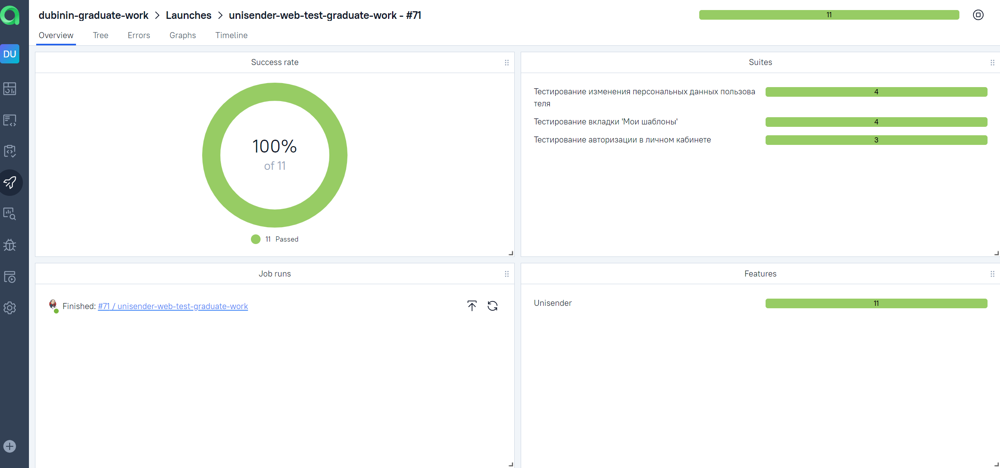

# <span style="color: white"> Дипломая работа по автоматизации тестовых сценариев на UI сайта [Unisender](https://www.unisender.com/) и API сервиса [Petstore](https://petstore.swagger.io/) </span>

#### Unisender — маркетинговый сервис для email-рассылок и не только. В нём есть множество инструментов для маркетинга - управление списками подписчиков, A/B тесты, сегментация, создание форм подписки, рассылки не только email, но и SMS, и Viber — приходите и пользуйтесь.
#### Petstore — образец приложения, которое можно использовать для практики REST-запросов. Этот сайт имитирует онлайн-зоомагазин, и пользователи могут добавлять и получать информацию о своих питомцах.
<p align="center">

</p>


## :pushpin: Содержание:

- [Использованный стек технологий](#computer-использованный-стек-технологий)
- [Запуск тестов из терминала](#arrow_forward-запуск-тестов-из-терминала)
- [Сборка в Jenkins](#сборка-в-jenkins)
- [Пример Allure-отчета](#пример-allure-отчета)
- [Уведомления в Telegram с использованием бота](#уведомления-в-telegram-с-использованием-бота)
- [Видео примера запуска тестов в Selenoid](#-видео-примера-запуска-теста-в-selenoid)

## :computer: Использованный стек технологий

<p align="center">


</p>

- В данном проекте автотесты написаны на языке <code>Java</code> с использованием фреймворка для тестирования <code>Selenide</code>.
- В качестве сборщика был использован - <code>Gradle</code>.
- Для тестирования WEB UI использованы фреймворки <code>JUnit 5</code> и [Selenide](https://selenide.org/).
- Для тестирования API использованы фреймворки <code>REST Assured</code> и <code>Lombock</code>.
- При прогоне тестов браузер запускается в [Selenoid](https://aerokube.com/selenoid/).
- Для удаленного запуска реализована параметризированная джоба в <code>Jenkins</code> с формированием Allure-отчета и отправкой результатов в <code>Telegram</code> при помощи бота.
- Осуществлена интеграция с <code>Allure TestOps</code> и <code>Jira</code>

Содержание Allure-отчета:
* Шаги теста;
* Скриншот страницы на последнем шаге;
* Page Source;
* Логи браузерной консоли;
* Видео выполнения автотеста.

## :arrow_forward: Запуск автотестов

### Запуск тестов из терминала

```
clean remote_test 
clean
${TASK}
-Dremote=${REMOTE_DRIVER_URL}
-Dbrowser=${BROWSER}
-DbrowserSize=${BROWSER_SIZE}
```

###  Параметры сборки

* <code>TASK</code> – задача на прогон тестов. Варианты: WEB, API, Regress.
* <code>REMOTE_DRIVER_URL</code> – адрес удаленного сервера, на котором будут запускаться тесты.
* <code>BROWSER</code> – браузер, в котором будут выполняться тесты. По-умолчанию - <code>chrome</code>.
* <code>BROWSER_SIZE</code> – размер окна браузера, в котором будут выполняться тесты.


##  Сборка в Jenkins
<p align="center">

</p>

##  Пример Allure-отчета


<p align="center">

</p>

##  Интеграция с Allure TestOps

Выполнена интеграция сборки <code>Jenkins</code> с <code>Allure TestOps</code>.
Результат выполнения автотестов отображается в <code>Allure TestOps</code>
На Dashboard в <code>Allure TestOps</code> отображена статистика пройденных тестов.

<p align="center">

</p>

##  Интеграция с Jira

Реализована интеграция <code>Allure TestOps</code> с <code>Jira</code>, в тикете отображается информация, какие тест-кейсы были написаны в рамках задачи и результат их прогона.

<p align="center">

</p>

##  Уведомления в Telegram с использованием бота

После завершения сборки, бот созданный в <code>Telegram</code>, автоматически обрабатывает и отправляет сообщение с результатом.

| ALL PASSED                            | WITH FAILED AND SKIPPED                |
|---------------------------------------|----------------------------------------|
|  |  |

##  Видео примера запуска тестов в Selenoid

К каждому тесту в отчете прилагается видео прогона.
<p align="center">
  
</p>
