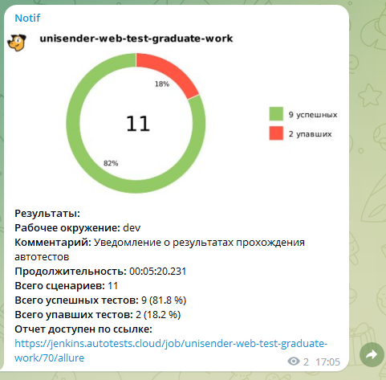

# <span style="color: white"> Дипломая работа по автоматизации тестовых сценариев на UI сайта [Unisender](https://www.unisender.com/)</span>

#### Unisender — маркетинговый сервис для email-рассылок и не только. В нём есть множество инструментов для маркетинга - управление списками подписчиков, A/B тесты, сегментация, создание форм подписки, рассылки не только email, но и SMS, и Viber — приходите и пользуйтесь.
<p align="center">

</p>


## :pushpin: Содержание:

- [Использованный стек технологий](#computer-использованный-стек-технологий)
- [Сборка в Jenkins](#-сборка-в-jenkins)
- [Пример Allure-отчета](#-пример-allure-отчета)
- [Интеграция с Allure TestOps](#-интеграция-с-allure-testops)
- [Интеграция с Jira](#-интеграция-с-jira)
- [Уведомления в Telegram с использованием бота](#-уведомления-в-telegram-с-использованием-бота)

## :computer: Использованный стек технологий

<p align="center">
<a href="https://www.jetbrains.com/idea/"></a>
<a href="https://www.java.com/"></a>
<a href="https://ru.selenide.org/"></a>
<a href="https://aerokube.com/selenoid/latest/"></a>
<a href="https://docs.qameta.io/allure-report/"></a>
<a href="https://qameta.io/"></a>
<a href="https://gradle.org/"></a>
<a href="https://junit.org/junit5/docs/current/user-guide/"></a>
<a href="https://github.com/"></a>
<a href="https://www.jenkins.io/"></a>
<a href="https://telegram.org/?1"></a>
<a href="https://www.atlassian.com/ru/software/jira"></a>
</p>

- В данном проекте автотесты написаны на языке <code>Java</code> с использованием фреймворка для тестирования <code>Selenide</code> и платформы <code>JUnit 5</code>.
- В качестве сборщика был использован - <code>Gradle</code>.
- При прогоне тестов браузер запускается в [Selenoid](https://aerokube.com/selenoid/).
- Для удаленного запуска реализована параметризированная джоба в <code>Jenkins</code> с формированием Allure-отчета и отправкой результатов в <code>Telegram</code> при помощи бота.
- Осуществлена интеграция с <code>Allure TestOps</code> и <code>Jira</code>

## :arrow_forward: Запуск автотестов

### Запуск тестов из терминала

```
clean
remote_test
-Dremote=${REMOTE_DRIVER_URL}
-Dbrowser=${BROWSER}
-DbrowserSize=${BROWSER_SIZE}
```

###  Параметры сборки

* <code>REMOTE_DRIVER_URL</code> – адрес удаленного сервера, на котором будут запускаться тесты.
* <code>BROWSER</code> – браузер, в котором будут выполняться тесты. По-умолчанию - <code>chrome</code>.
* <code>BROWSER_SIZE</code> – размер окна браузера, в котором будут выполняться тесты.

## <a href="https://jenkins.autotests.cloud/job/unisender-web-test-graduate-work/"> Сборка в Jenkins</a>
<p align="center">

</p>

## <a href="https://jenkins.autotests.cloud/job/unisender-web-test-graduate-work/72/allure/"> Пример Allure-отчета</a>


<p align="center">

</p>

## <a href="https://allure.autotests.cloud/launch/27537"> Интеграция с Allure TestOps</a>

Выполнена интеграция сборки <code>Jenkins</code> с <code>Allure TestOps</code>.
Результат выполнения автотестов отображается в <code>Allure TestOps</code>
На Dashboard в <code>Allure TestOps</code> отображена статистика пройденных тестов.

<p align="center">

</p>

## <a href="https://jira.autotests.cloud/browse/HOMEWORK-777"> Интеграция с Jira</a>

Реализована интеграция <code>Allure TestOps</code> с <code>Jira</code>, в тикете отображается информация, какие тест-кейсы были написаны в рамках задачи и результат их прогона.

<p align="center">

</p>

##  Уведомления в Telegram с использованием бота

После завершения сборки, бот созданный в <code>Telegram</code>, автоматически обрабатывает и отправляет сообщение с результатом.

| ALL PASSED                            | WITH FAILED                |
|---------------------------------------|---------------------------------------|
|  |  |

##  Видео примера запуска тестов в Selenoid

К каждому тесту в отчете прилагается видео прогона.

Пример прохождения теста на создание шаблона:
<p align="center">
  
</p>
